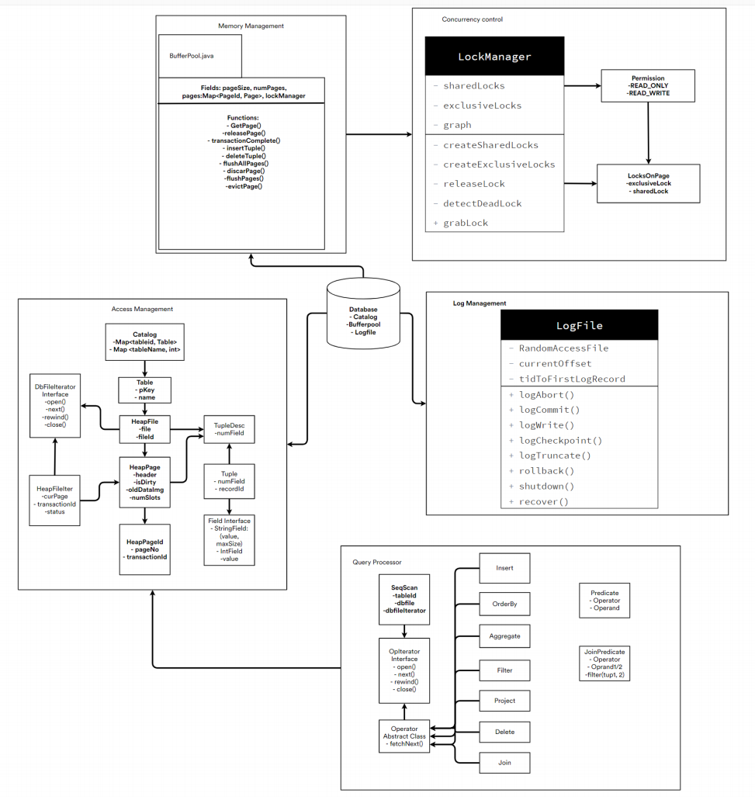

# Code and Design: 

**Database Java Code**: 
- source code link: [src code](https://github.com/yuanfengli168/DatabaseSystemsInternals/tree/main/JavaCode/simple-db-lyf99/src/java/simpledb)  
- test code link: [test code](https://github.com/yuanfengli168/DatabaseSystemsInternals/tree/main/JavaCode/simple-db-lyf99/test/simpledb)

**Design Chart** (blueprint): 

## Folders: 
1. All codes are in the **JavaCode folder**.
2. All Design are in **Design folder**, including my blueprint.
3. All concepts and my own explainations are in **Paper folder**. 

For your convenience, I have also pasted the blueprint here for your reference. Thank you for your time and consideration. 

If you have any questions, please contact me via: 
- cell phone: 2068893335
- email:      lyf99@uw.edu